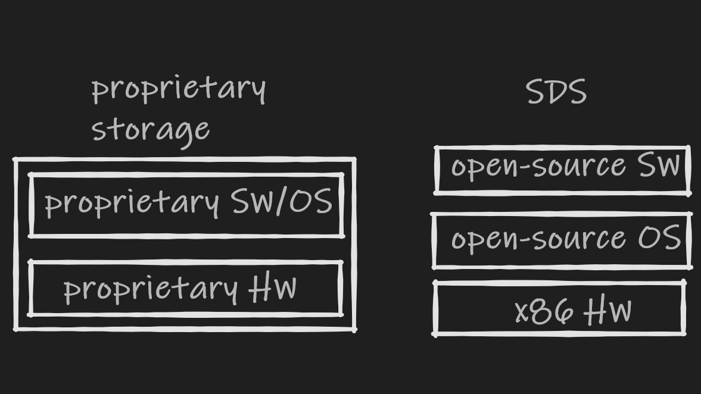
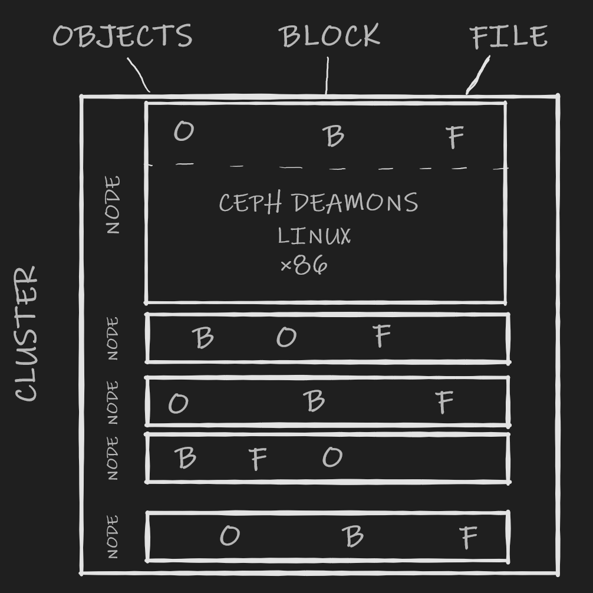

# SUT_web_programming_final_article

A repository to describe Ceph in Persian language

ریپویی برای توضیح Ceph به زبان فارسی

# Ceph

 رضا عرفان‌آرانی

<h2 dir="rtl" style="position:right;">
Software-Defined Storage (SDS)
</h2>

قبل از این که درباره خود Ceph توضیج دهیم بهتر است با SDSها آشنا شویم.
 
تا سال‌ها ذخیره‌سازی داده‌ها به صورت یک پکیج اختصاصی که بهش (Proprietary Storage) گفته می‌شد صورت می‌گرفت.
 این مدل اینگونه بود که به اصطلاح بدنه(Proprietary Hardware) و سر(Proprietary Software) را در قالب یک پکیج به شما تحویل می‌داد. اما دنیای مدرن جواب مدرن‌تری میخواست...
 
درواقع SDSها این سر و بدنه را از هم جدا کردند که منجر به انعطاف بیشتر، سادگی بیشتر، انتخاب‌های متنوع‌تر و صرفه‌جویی در هزینه‌ها می‌شود. 

هر مدلی برای دخیره‌سازی داده‌ها نیاز به دو عنصر اصلی دارد:
 
1- سخت‌افزار(Hardware): سخت‌افزار یا همان درایوها که داده‌ها درواقع آنجا ذخیره می‌شوند. 
 
2- نرم‌افزار(Software): نرم‌افزار که درایوها را به عنوان یک کاسه بزرگ از storageها ترکیب می‌کند.

درواقع Proprietary Storageها اینگونه بودند که این دو بخش را با هم پک کرده و تحویل می‌دادند. برای مثال از این نوع Storageها می‌توان HPE، IBM، Dell EMC و ... اشاره کرد. این آرایه از داده‌ها طراحی شدند تا به عنوان دستگاه‌هایی با اتحاد بالا کنار هم کار کنند که برای ما بالاترین عملکرد، کوتاه‌ترین زمان انتظار و یک کاربره بودن برای مدیریت آرایه را فراهم می‌‌کند.
 
این نوع از حافظه بسیار مورد استفاده هست و یکی از خوبی‌های دیگر آن این است که برای ساپورت تنها یک پشتیبانی لازم دارد و این برای بسیاری از جاها نقش مهمی ایفا می‌کند. اما این سیستم‌ها هزینه بالای اولیه‌ای برای خرید و راه اندازی دارند. همچنین افراد محدود به محدودیت‌های سازنده آن‌ها هستند. 

مدل دیگر برای ذخیره سازی داده‌ها استفاده از SDSهاست. در واقع در این مدل نرم‌افزار تایین می‌کند هدف سخت‌افزار چیست. (software defines Storage!). برای این مدل کافیست یک Hardware، یک سیستم‌عامل open source و یک نرم‌افزار open source داشته باشیم و با استفاده از این 3 مجموعه، پایگاه داده خود را بسازیم. این جداسازی باعث می‌شود که شما محدود به سخت‌افزار و نرم‌افزار یک فروشنده حاص نشوید و حتی به شما این امکان را می‌دهد که هر زمان اراده کنید hardware خود را عوض کنید ولی از همان software قبلی استفاده کنید. همچنین وقتی شما ازین مدل استفاده می‌کنید با هزینه بسیار کمتری برای سر هم کردن قطعات، نصب قطعات و حتی نگهداری آنها مواجه خواهید شد. 
 
البته جدا از خوبی‌های این مدل یک سری معایب واضحی نیز دارد. اولین عیب این است که این مدل می‌تواند دارای طراحی بسیار پیچیده شود و باید از چندین (دروافع 3 تا) user interface برای آن استفاده کنیم(یکی برای HW دیگری برای SW و آخری برای OS)
همچنین در صورت نیاز به پشتیبانی شما 3 پشتیبانی مجزا از هم دارید که این خیلی وقت‌ها دردسرزا می‌شود.
 
(البته ابزارهایی برای جلوگیری از این عیب به وجود آمده‌اند که شما تنها با یک پشتیبان در ارتباط باشید ولی تمام مزایای SDSها را نیز  داشته باشید مانند <a href="https://softiron.com/">SOFTIRON</a> که از بحث این مقاله خارج است.)

  

شمای کلی دو نوع Storage معرفی شده

<h2 dir="rtl" style="position:right;">
Ceph
</h2>

حال که با SDSها آشنا شده ایم به معرفی Ceph می‌پردازیم. Ceph درواقع یک SDS است و به نوعی می‌توان گفت آینده Storageها می‌باشد. Ceph یک پروژه متن باز است که با پیاده‌سازی یک object-storage روی یک cluster یکپارچه کامپیوتری به ما قابلیت ذخیره‌سازی در سطوح object، file و block را می‌دهد. علاوه بر این امکانات ceph با این که 100درصد open-source هست اما دارای پشتیبانی توسط شرکت red-hat هست که باعث شده کمپانی‌ها و افراد زیادی به سراغ آن بروند. 

اگر بخواهیم یک چشم‌انداز از کلیت Ceph ارائه دهیم: 
Ceph یک SDS است پس مانند شمایی که برای SDSها در قسمت قبل رسم کردیم با داشتن یک سرور x86 و یک سیستم‌عامل لینوکس و یک Ceph daemon ما دارای یک node از Ceph هستیم. ولی درواقع اگر ما کارایی و دسترسی بالا می‌خواهیم تعداد nodeهای بیشتری لازم داریم. با تجمیع این nodeها روی هم ما یک Ceph cluster تشکیل می‌دهیم. یکی از خوبی‌های Ceph همین clusterش است. نگهداری داده‌ها بالاخره پس از مدتی بسیار سخت خواهد شد اما برای یک cluster هیچ حد بالای محکمی وجود ندارد. 
 
دیگر خوبی Ceph که بالا به آن اشاره شد این است که Ceph درواقع یک object store است اما چیزی که خیلی مزیت حساب می‌شود این است که شما می‌توانید برای object blockها و fileهاتون نیز فضای ذخیره تعریف کنید آن هم توی همان clusterی که دارید. و این یعنی با روزهایی که برای هر برنامه باید یک storage stack جداگانه می‌ساختیم و از آن نگهداری می‌کردیم تمام شده است. تمام داده‌ها در بین درایوها و nodeها در همان cluster پخش می‌شود. سپس یک الگوریتم خلاقانه به اسم CRUSH که ساخته خود توسعه‌دهنده‌های Ceph است استفاده می‌شود و تا به صورت الگوریتمیک داده‌ها ذخیره و پیدا شوند. این الگورتیم یک الگوریتم pesudo-random هست، بدین معنی که درواقع رندوم نیست ولی به نظر انتخاب فضای ذخیره و پیدا کردنش رندوم می‌آید. (<a href="https://access.redhat.com/documentation/en-us/red_hat_ceph_storage/1.2.3/html/storage_strategies/introduction_to_crush">اطلاعات بیشتر</a>)
 
همچنین Ceph از erasure coding استفاده می‌کند که باعث می‌شود بازیابی اطلاعات از درایوها بسیار سریع‌تر از قبل شود. قبلا از روش‌هایی همچون RAID استفاده می‌شد که برای درایوها درایوهای بک‌آپ تهیه می‌شد و در آن‌ها اطلاعات ذخیره می‌شد تا در صورت از بین رفتن اطلاعات اصلی بتوان از طریق آن اطلاعات را بازیابی کرد. اما حجم اطلاعات امروزی باعث می‌شود که این کار ساعت‌ها به طول بیانجامد. erasure coding  اطلاعات را خورد می‌کند و سپس encode کرده و در نقاط پراکنده ذحیره‌ می‌کند. همچنین استفاده از این روش فضای کمتری برای ذخیره داده‌هایمان نیاز دارد چرا که با الگوریتم محاسباتی خود حجم اصلی دیتا را می‌تواند از یک حجم کوچک‌تر شده از دیتا بازیابی کند.

البته نباید از یاد برد چیزی بدون عیبی در این دنیا وجود ندارد. برای این که از Ceph این امکانات فوقولاده رو بتوانید دریافت کنید کار ساده‌ای برای راه‌اندازی و نصب و سرهم کردنش ندارید و برای این کار به مقدار قابل توجهی دانش کامپیوتری نیاز دارید.

<h2 dir="rtl" style="position:right;">
Ceph چگونه کار می‌کند؟
</h2>

اگر شکل را مشاهده کنید می‌بینید که Ceph چندین slot یا همان Node سرور دارد که اطلاعات به کمک الگوریتم CRUSH در آنها ذخیره می‌شوند. یکی از خوبی های Ceph این است که اگر شما فضا کم آوردید می‌توانید بدون هیچ مشکلی یک Node دیگر به Nodeهای قبلی اضافه کنید و الگوریتم خودش ذخیره‌سازی داده‌ها را برایتان انجام می‌دهد. 
 
در مورد بخش Softwareش اگر بخواهیم حرف بزنیم باید گفت که کاربر با تعریف یک POOL بر روی Ceph Software Defined Object Storage System می‌تواند یک Software Storage Space مجازی ایجاد کند و دیتابیس را با کاربرهای محتلف share کند. شما با دیدن این فضای ذخیره مجازی می‌توانید به راحتی داده را انتخاب کند و از Cluster مربوطه اطلاعات را دریافت کند. 

<h2 dir="rtl" style="position:right;">
در پایان...
</h2>

در پایان باید گفت که این تکنولوژی به سرعت در حال رشد و توسعه است و هر روزه شرکت‌های بیشتری سرتاسر دنیا به آن روی می‌آورند. برای یک شرکت نوپا چنین تکنولوژی‌ای لزومی ندارد اما با بزرگ‌‌تر شدن شرکت و زیاد شدن قابل توجه دیتا دیر یا زود شرکت‌ها مجبور به کوچ به سمت استفاده از storageهای Clusterی می‌شوند. 

<h2 dir="rtl" style="position:right;">
منابع
</h2>

> https://ceph.com/en/

> https://www.45drives.com/

> https://www.youtube.com/watch?v=XaoCxw-IVko

> https://www.youtube.com/watch?v=_zBnR-PIGgQ
